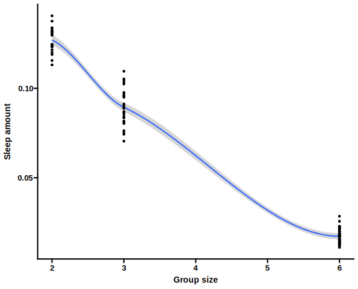

# Flyhostel modelling

Simulate sleep/wake patterns in groups of flies


Implement an agent based model of group sleep in the flyhostel with these three rules:

1) Flies can wake up spontaneously with probability p
2) Flies can wake up because of an interaction with another fly
3) Flies stay awake for a given bout length 


## Quickstart

```
import pandas as pd
import glob
import os.path
from bin.run import run

for number_of_animals in [2, 3, 6]:
    run(
        number_of_animals=number_of_animals, time_steps=12*3600,
        output="modelling", n_jobs=10
    )

data=[]
files=sorted(glob.glob("modelling/simulation_default_model*.csv"))
for f in files:
    tokens=os.path.basename(f).strip(".csv").split("_")
    number_of_animals=int(tokens[3])
    replicate=int(tokens[4])
    
    d=pd.read_csv(f)
    d["number_of_animals"]=number_of_animals
    d["replicate"]=replicate
    data.append(d)
df=pd.concat(data, axis=0).reset_index(drop=True)
df.to_csv("modelling_result.csv")
```

```
library(data.table)
library(ggplot2)
library(ggprism)
theme_set(theme_prism())
df <- data.table::fread("modelling_result.csv")
df[, V1 := NULL]
options(repr.plot.width=20, repr.plot.height=10)
ggplot(data=df, aes(x=number_of_animals, y=asleep)) + geom_smooth() + geom_point()
```


